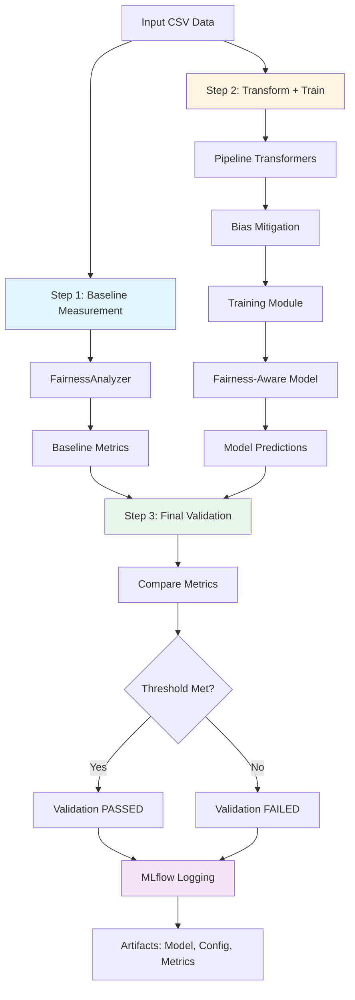

# Fairness Pipeline Development Toolkit

**Version:** 0.5.0

A unified, statistically-rigorous framework for **detecting**, **mitigating**, **training**, and **validating** fairness in ML workflows.  
The toolkit provides both **modular components** and an **integrated end-to-end workflow** spanning data-to-model fairness — enabling teams to move from ad-hoc checks to automated, continuous fairness assurance in CI/CD.

## 🚀 Quick Start: Integrated Workflow

The fastest way to get started is with the integrated three-step workflow:

```bash
fairpipe run-pipeline \
    --config config.yml \
    --csv data.csv \
    --output-dir artifacts/ \
    --mlflow-experiment fairness_workflow
```

This single command:
1. Measures baseline fairness on raw data
2. Applies bias mitigation and trains a fairness-aware model
3. Validates the final model against your threshold

See the [Integrated Workflow Architecture](#-integrated-workflow-architecture) section below for details, or check out `demo_integrated.ipynb` for a complete example.

---

## 🧩 Modules Overview

### **1. Measurement Module**
Implements fairness **metrics**, **statistical validation**, and **MLflow/pytest integration**.

**Features**
- Unified `FairnessAnalyzer` API with adapters for Fairlearn and Aequitas.  
- Metrics: demographic parity, equalized odds, MAE parity.  
- Intersectional analysis with `min_group_size`.  
- Statistical validation via bootstrap CIs and effect sizes.  
- CLI: `validate` for fairness audits.  

---

### **2. Pipeline Module**
Automates **bias detection**, **feature mitigation**, and **CI/CD fairness checks** for data engineering teams.

**Features**
- Bias Detection Engine (representation, statistical, and proxy analysis).  
- sklearn-compatible transformers:
  - `InstanceReweighting`
  - `DisparateImpactRemover`
  - `ReweighingTransformer`
  - `ProxyDropper`
- YAML-based orchestration with multiple profiles (`pipeline`, `training`).  
- CLI: `pipeline` for end-to-end mitigation and artifact generation.  

#### Minimal Pipeline YAML
```yaml
sensitive: ["sensitive"]
alpha: 0.05
pipeline:
  - name: reweigh
    transformer: InstanceReweighting
  - name: repair
    transformer: DisparateImpactRemover
    params:
      features: ["score"]
```

#### Config Schema Highlights
- `sensitive` (required): list of column names used for fairness analysis.
- `benchmarks` (optional): mapping of attribute → group → expected proportion.
- `pipeline`: ordered steps; each step needs a `transformer` key and optional `params` dict.
- Profiles are shallow-merged over top-level defaults; validation errors surface with helpful messages when keys are missing or mis-typed.

---

### **3. Training Module**
Enables **fair model training** by embedding fairness objectives directly into learning algorithms.

**Features**
- **ReductionsWrapper (scikit-learn):** wraps any estimator with `fairlearn.reductions.ExponentiatedGradient` for constraint-based training (e.g., Demographic Parity).  
- **FairnessRegularizer (PyTorch):** integrates fairness penalties (e.g., statistical dependence) into differentiable loss functions.  
- **LagrangianFairnessTrainer (PyTorch):** enforces fairness constraints via dual optimization (Lagrange multipliers).  
- **GroupFairnessCalibrator:** applies Platt Scaling or Isotonic Regression post-training to balance probabilities across groups.  
- **ParetoFrontier Visualization Tool:** visualizes the fairness–accuracy trade-off to guide stakeholder decisions.

**Usage Example (PyTorch Regularizer)**
```python
from fairness_pipeline_dev_toolkit.training.torch_.losses import FairnessRegularizerLoss
from fairness_pipeline_dev_toolkit.training.torch_.lagrangian import LagrangianFairnessTrainer
```

---

### **4. Monitoring Module**
Enables **continuous fairness monitoring**, **drift detection**, and **automated alerting** for production ML systems.

**Features**
- **RealTimeFairnessTracker:** sliding-window metric computation with configurable window sizes.  
- **FairnessDriftAndAlertEngine:** KS-test based drift detection with optional wavelet decomposition for multi-scale analysis.  
- **FairnessReportingDashboard:** Plotly-based visualizations and Markdown report generation.  
- **FairnessABTestAnalyzer:** A/B testing utilities for fairness comparisons.  
- **Streamlit/Dash Apps:** interactive dashboards for real-time monitoring (see `apps/monitoring_streamlit_app.py` and `apps/monitoring_dash_app.py`).  

**Usage Example**
```python
from fairness_pipeline_dev_toolkit.monitoring import (
    RealTimeFairnessTracker,
    FairnessDriftAndAlertEngine,
    ColumnMap,
    TrackerConfig,
)

tracker = RealTimeFairnessTracker(
    TrackerConfig(window_size=10_000, min_group_size=30),
    artifacts_dir="artifacts/monitoring"
)
cmap = ColumnMap(
    y_pred="predictions",
    y_true="labels",
    protected=["gender", "race"],
    intersections=[["gender", "race"]]
)
tracker.process_batch(df, cmap)

drift_engine = FairnessDriftAndAlertEngine(DriftConfig())
alerts = drift_engine.analyze(tracker.metrics_ts)
```

---

## 🏗️ Integrated Workflow Architecture

The toolkit provides an integrated end-to-end workflow that combines all modules into a unified three-step process:

### Architecture Diagram



### Three-Step Workflow

1. **Baseline Measurement**: Audit raw data for fairness issues before any transformations
2. **Transform Data + Train Model**: Apply bias mitigation pipeline, then train fairness-aware model
3. **Final Validation**: Compare post-training metrics to baseline and validate against threshold

### Quick Start: Integrated Workflow

```bash
fairpipe run-pipeline \
    --config config.yml \
    --csv data.csv \
    --output-dir artifacts/ \
    --mlflow-experiment fairness_workflow
```

See `demo_integrated.ipynb` for a complete example.

---

## 📋 Integrated Configuration Guide

The integrated workflow requires a configuration file that specifies pipeline transformations, training method, and validation criteria.

### Complete Config Schema

```yaml
# Required: Sensitive attributes
sensitive: ["sensitive"]  # or ["gender", "race"] for multiple

# Optional: Population benchmarks for representation checks
benchmarks:
  sensitive:
    A: 0.5
    B: 0.5

# Statistical test parameters
alpha: 0.05
proxy_threshold: 0.30

# Pipeline: Bias mitigation transformers (applied in order)
pipeline:
  - name: reweigh
    transformer: "InstanceReweighting"
    params: {}
  - name: repair
    transformer: "DisparateImpactRemover"
    params:
      features: ["f0", "f1", "f2"]
      sensitive: "sensitive"
      repair_level: 0.8

# Training: Fairness-aware model training (required for integrated workflow)
training:
  method: "reductions"  # Options: "reductions", "regularized", "lagrangian"
  target_column: "y"   # Target variable column name
  params:
    # Method-specific parameters (see below)

# Validation: Primary fairness metric and threshold
fairness_metric: "demographic_parity_difference"  # or "equalized_odds_difference"
validation_threshold: 0.05  # Maximum allowed unfairness (absolute value)
```

### Training Method Options

#### 1. Reductions (scikit-learn)

Uses Fairlearn's ExponentiatedGradient for constraint-based training.

```yaml
training:
  method: "reductions"
  target_column: "y"
  params:
    constraint: "demographic_parity"  # or "equalized_odds"
    eps: 0.01                        # Constraint tolerance
    T: 50                            # Max iterations
    base_estimator: null             # Default: LogisticRegression
```

#### 2. Regularized (PyTorch)

Integrates fairness penalties into loss function.

```yaml
training:
  method: "regularized"
  target_column: "y"
  params:
    eta: 0.5          # Fairness regularization strength
    epochs: 10
    lr: 0.001
    device: "cpu"     # or "cuda"
```

#### 3. Lagrangian (PyTorch)

Enforces fairness constraints via dual optimization.

```yaml
training:
  method: "lagrangian"
  target_column: "y"
  params:
    fairness: "demographic_parity"  # or "equal_opportunity"
    dp_tol: 0.02                    # Demographic parity tolerance
    eo_tol: 0.02                    # Equal opportunity tolerance
    model_lr: 0.001
    lambda_lr: 0.01
    epochs: 10
    batch_size: 128
    device: "cpu"
```

### Validation Threshold Guidelines

- **Demographic Parity Difference**: Typically aim for < 0.05 (5% difference in selection rates)
- **Equalized Odds Difference**: Typically aim for < 0.10 (10% difference in TPR/FPR)
- **Threshold selection**: Consider your use case, legal requirements, and stakeholder input

### Example Configurations

**Minimal Config (Reductions Method):**
```yaml
sensitive: ["sensitive"]
pipeline:
  - name: reweigh
    transformer: "InstanceReweighting"
training:
  method: "reductions"
  target_column: "y"
  params:
    constraint: "demographic_parity"
fairness_metric: "demographic_parity_difference"
validation_threshold: 0.05
```

**Full Config (Lagrangian Method):**
```yaml
sensitive: ["gender", "race"]
benchmarks:
  gender: {M: 0.5, F: 0.5}
alpha: 0.05
pipeline:
  - name: reweigh
    transformer: "InstanceReweighting"
  - name: repair
    transformer: "DisparateImpactRemover"
    params:
      features: ["score", "age"]
      sensitive: "gender"
      repair_level: 0.8
training:
  method: "lagrangian"
  target_column: "y_true"
  params:
    fairness: "demographic_parity"
    dp_tol: 0.02
    epochs: 50
    batch_size: 128
fairness_metric: "equalized_odds_difference"
validation_threshold: 0.10
```

### Backward Compatibility

Configs without a `training` section continue to work for pipeline-only execution:
- Use `fairpipe pipeline` command for pipeline-only workflows
- Use `fairpipe run-pipeline` for integrated workflows (requires training section)

---

### Installation
```bash
python -m venv .venv
source .venv/bin/activate
pip install -e .[adapters]
# Optional extras
pip install -e .[training,monitoring]
```

To install developer tooling without pins:
```bash
pip install -r requirements-dev.in
```

To generate pinned requirements with `pip-tools`:
```bash
pip install pip-tools
pip-compile --extra training --extra monitoring --extra adapters \
    --output-file=requirements.txt requirements-dev.in
pip install -r requirements.txt
```

> ⚠️ PyTorch wheels depend on platform/accelerator support. Follow the commands from [pytorch.org/get-started](https://pytorch.org/get-started/locally/) before enabling the `training` extra.

pre-commit hooks ensure consistent formatting:
```bash
pre-commit install
```

### Pre-commit Hooks
- The repository includes `.pre-commit-config.yaml` with `ruff`, `black`, `isort`, and `nbstripout`.
- Run `pre-commit install` once per clone (see installation above) to enable auto-formatting and notebook sanitisation on every commit.

## Quick Start

### Option 1: Integrated Workflow (Recommended)

Run the complete three-step workflow with a single command:

```bash
# Create a config.yml with training section (see Integrated Configuration Guide)
fairpipe run-pipeline \
    --config config.yml \
    --csv data.csv \
    --output-dir artifacts/ \
    --mlflow-experiment fairness_workflow
```

### Option 2: Individual Module Commands

Use individual commands for specific tasks:

```bash
# Check version
fairpipe version

# Validate fairness metrics on a dataset
fairpipe validate \
  --csv data.csv \
  --y-true y_true \
  --y-pred y_pred \
  --sensitive gender \
  --with-ci --with-effects

# Run bias detection and mitigation pipeline (pipeline only, no training)
fairpipe pipeline \
  --config pipeline.config.yml \
  --csv data.csv \
  --out-csv output.csv
```

## CLI Usage

> **Note:** The `fairpipe` command is available as a shorthand entry point. You can also use the full form: `python -m fairness_pipeline_dev_toolkit.cli.main <command>`. The entry point is defined in `pyproject.toml`.
>
> **Troubleshooting:** If you encounter `ModuleNotFoundError` when using `fairpipe`, try using the full form: `python -m fairness_pipeline_dev_toolkit.cli.main <command>`. This is especially useful after reinstalling the package in editable mode.

### 0️⃣ Integrated Workflow (Recommended)

Execute the complete three-step workflow:

```console
fairpipe run-pipeline \
  --config config.yml \
  --csv data.csv \
  --output-dir artifacts/workflow \
  --mlflow-experiment fairness_workflow \
  --min-group-size 30 \
  --train-size 0.8
```

**What it does:**
- Runs baseline measurement on raw data
- Applies pipeline transformations and trains fairness-aware model
- Validates final metrics against threshold
- Saves all artifacts (model, metrics, reports) and logs to MLflow

**Exit codes:**
- `0`: Validation passed (metrics meet threshold)
- `1`: Validation failed (metrics exceed threshold) or error occurred

### 1️⃣ Fairness Validation

```console
fairpipe validate \
  --csv dev_sample.csv \
  --y-true y_true \
  --y-pred y_pred \
  --sensitive sensitive \
  --backend native \
  --with-ci \
  --ci-level 0.95 \
  --with-effects \
  --out report.md
```

### 2️⃣ Fair Pipeline Execution (Pipeline Only)

```console
fairpipe pipeline \
  --config fairness_pipeline_dev_toolkit/pipeline/pipeline.config.yml \
  --csv dev_sample.csv \
  --out-csv artifacts/sample.transformed.csv \
  --detector-json artifacts/detectors.json \
  --report-md artifacts/pipeline_run.md
```

### 3️⃣ Fair Model Training (Training Only)

**Train with Regularizer (Pareto Frontier):**
```console
fairpipe train-regularized \
  --csv data.csv \
  --etas "0.0,0.2,0.5,1.0" \
  --epochs 50 \
  --lr 1e-3 \
  --out-json artifacts/pareto_points.json \
  --out-png artifacts/pareto.png
```

**Train with Lagrangian Constraints:**
```console
fairpipe train-lagrangian \
  --csv data.csv \
  --fairness demographic_parity \
  --dp-tol 0.02 \
  --epochs 100 \
  --batch-size 128 \
  --out-json artifacts/training_history.json
```

### 4️⃣ Post-Training Calibration

```console
fairpipe calibrate \
  --csv scores.csv \
  --method platt \
  --min-samples 20 \
  --out-csv artifacts/calibrated_scores.csv
```

### 5️⃣ Utility Commands

**Check version:**
```console
fairpipe version
```

**Pre-commit sample check:**
```console
fairpipe sample-check
```

## Testing & Validation

Run all tests:

```console
pytest -q
```

**Test Coverage:**
- **90 tests** total, including:
  - Integration tests: config schema, orchestrator, MLflow logging (22 tests)
  - System tests: CLI end-to-end workflows (3 tests)
  - Module tests: measurement, pipeline, training, monitoring

Run specific test suites:

```console
# Integration tests
pytest tests/integration/ -q

# System tests
pytest tests/system/ -q

# Pipeline tests
pytest tests/pipeline/ -q

# Training tests
pytest tests/training/ -q
```

## Repository Structure

```
fairness_pipeline_dev_toolkit/
├── cli/                       # CLI commands including run-pipeline
├── integration/               # Integrated workflow orchestrator
│   ├── orchestrator.py        # Three-step workflow execution
│   ├── mlflow_logger.py       # Complete MLflow logging
│   └── reporting.py           # Report generation
├── measurement/
├── metrics/
├── stats/
├── pipeline/
│   ├── config/                # Config loader with training support
│   ├── detectors/
│   ├── orchestration/
│   ├── transformers/
│   └── pipeline.config.yml
├── training/
│   ├── sklearn_/              # ReductionsWrapper
│   ├── torch_/                # Loss + LagrangianTrainer
│   ├── postproc/              # GroupFairnessCalibrator
│   ├── viz/                   # Pareto Frontier Visualization
│   └── __init__.py
├── monitoring/
│   ├── tracker.py             # RealTimeFairnessTracker
│   ├── drift.py               # FairnessDriftAndAlertEngine
│   ├── dashboard.py           # FairnessReportingDashboard
│   ├── abtest.py              # FairnessABTestAnalyzer
│   └── config.py              # MonitoringSettings, DriftConfig
├── apps/
│   ├── monitoring_streamlit_app.py
│   └── monitoring_dash_app.py
├── tests/
│   ├── integration/           # Integration tests (orchestrator, MLflow)
│   ├── training/
│   ├── pipeline/
│   ├── monitoring/
│   └── system/                # System tests including CLI e2e
├── demo_integrated.ipynb      # Integrated workflow demo
└── artifacts/
```

## Contributing

We welcome contributions! Please see [CONTRIBUTING.md](CONTRIBUTING.md) for guidelines on:
- Code style and formatting (enforced via pre-commit hooks)
- Testing requirements
- Pull request process

## License

This project is licensed under the Apache License 2.0. See [LICENSE](LICENSE) for details.