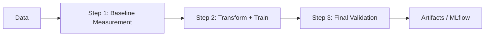

# Fairness Pipeline Development Toolkit

**Version:** 0.7.2
**Status:** Production-ready | Available on [PyPI](https://pypi.org/project/fairpipe/)


A unified, statistically-rigorous framework for **detecting**, **mitigating**, **training**, and **validating** fairness in ML workflows. The toolkit provides both **modular components** and an **integrated end-to-end workflow** spanning data-to-model fairness — enabling teams to move from ad-hoc checks to automated, continuous fairness assurance in CI/CD.

---

## Quick Install

### From PyPI

The toolkit is available on [PyPI](https://pypi.org/project/fairpipe/). Install with pip:

```bash
pip install fairpipe
```

This installs the core package with all essential dependencies. For optional features, see [Installation Options](#installation-options) below.

## Installation Options

### Core Installation (Default)

The base installation includes all essential fairness measurement and pipeline components:

```bash
pip install fairpipe
```

**Included:**
- Fairness metrics computation (demographic parity, equalized odds, etc.)
- Bias detection and mitigation transformers
- Statistical validation (bootstrap CIs, effect sizes)
- Pipeline orchestration
- Integration with scikit-learn

### Optional Extras

Install additional features using extra dependency groups:

```bash
# REST API server (FastAPI + Swagger UI)
pip install fairpipe[api]

# Training methods (PyTorch-based fairness-aware training)
pip install fairpipe[training]

# Production monitoring tools (dashboards and drift detection)
pip install fairpipe[monitoring]

# External metric backends (Fairlearn, Aequitas adapters)
pip install fairpipe[adapters]

# Install all optional dependencies
pip install fairpipe[api,training,monitoring,adapters]
```

**Optional dependency groups:**
- **`api`**: FastAPI REST server — enables `fairpipe serve` and all HTTP endpoints
- **`training`**: PyTorch-based training methods (regularized loss, Lagrangian constraints, calibration)
- **`monitoring`**: Production monitoring tools (Streamlit/Dash dashboards, drift detection, alerting)
- **`adapters`**: External metric backends (Fairlearn, Aequitas) for compatibility with existing tools

### Development Installation

For development or to use the latest features from source:

```bash
git clone https://github.com/SvrusIO/fAIr
cd fAIr
pip install -e ".[training,monitoring,adapters,dev]"
```

### System Requirements

- **Python**: 3.10 or higher (tested on 3.10, 3.11, 3.12)
- **Operating System**: macOS, Linux, or Windows
- **Disk Space**: 
  - Core: ~500 MB
  - With training: ~2 GB
  - With monitoring: ~1 GB

**Note on PyTorch**: If installing the `training` extra, PyTorch will be installed automatically. For GPU support, install PyTorch separately following instructions at [pytorch.org/get-started](https://pytorch.org/get-started/locally/).

---

## Quick Start

### 1. Install the Package

```bash
pip install fairpipe
```

### 2. Quick CLI Usage

Run a quick fairness validation on your predictions:

```bash
fairpipe validate \
  --csv data.csv \
  --y-true y_true \
  --y-pred y_pred \
  --sensitive gender \
  --with-ci \
  --out report.md
```

Run the complete integrated workflow (baseline → transform+train → validate):

```bash
fairpipe run-pipeline \
  --config config.yml \
  --csv data.csv \
  --output-dir artifacts/
```

Start the REST API server:

```bash
pip install fairpipe[api]
fairpipe serve --host 0.0.0.0 --port 8000
# → Swagger UI at http://localhost:8000/docs
```

### 3. Quick Python Usage

```python
from fairpipe.io import load_data
from fairpipe.metrics import FairnessAnalyzer

# Load your data — CSV or Parquet, auto-detected by extension
df = load_data("data.csv")   # or "data.parquet"

# Pass DataFrame columns directly — no .to_numpy() needed
analyzer = FairnessAnalyzer(min_group_size=30)
result = analyzer.demographic_parity_difference(
    y_pred=df["y_pred"],     # pd.Series, list, or np.ndarray all accepted
    sensitive=df["gender"],
    with_ci=True
)

print(f"DPD: {result.value:.4f}")
print(f"95% CI: [{result.ci[0]:.4f}, {result.ci[1]:.4f}]")

# Or use the DataFrame proxy to avoid repeating column names
proxy = FairnessAnalyzer.from_dataframe(df, y_pred_col="y_pred", sensitive_col="gender")
result = proxy.demographic_parity_difference(with_ci=True)
```

For more examples, see [Usage Examples](#usage-examples) below or check the [Integration Guide](docs/integration_guide.md).

### Workflow Overview

The integrated pipeline (`fairpipe run-pipeline`) runs a three-step workflow from raw data to validated model and artifacts:



- **Step 1 (Baseline Measurement):** Compute fairness metrics on an unconstrained baseline model; these baseline metrics are used in Step 3 for comparison.
- **Step 2 (Transform + Train):** Apply bias mitigation (e.g. reweighing, repair) and train a fairness-aware model.
- **Step 3 (Final Validation):** Evaluate the trained model and compare to baseline; pass/fail against a threshold.

---

## Usage Examples

### Example 1: Fairness Validation

Validate fairness metrics on predictions with confidence intervals and effect sizes.

**CLI:**
```bash
fairpipe validate \
  --csv dev_sample.csv \
  --y-true y_true \
  --y-pred y_pred \
  --sensitive sensitive \
  --with-ci \
  --with-effects \
  --out artifacts/validation_report.md
```

**Python:**
```python
import pandas as pd
from fairpipe.metrics import FairnessAnalyzer

# Load data
df = pd.read_csv("data.csv")

# Initialize analyzer
analyzer = FairnessAnalyzer(min_group_size=30, backend="native")

# Compute demographic parity difference with confidence intervals
result = analyzer.demographic_parity_difference(
    y_pred=df["y_pred"],
    sensitive=df["gender"],
    with_ci=True,
    ci_level=0.95
)

print(f"Demographic Parity Difference: {result.value:.4f}")
print(f"95% CI: [{result.ci[0]:.4f}, {result.ci[1]:.4f}]")
print(f"Group sizes: {result.n_per_group}")
```

### Example 2: Bias Detection and Mitigation Pipeline

Detect bias in data and apply mitigation transformers.

**CLI:**
```bash
fairpipe pipeline \
  --config pipeline.config.yml \
  --csv dev_sample.csv \
  --out-csv artifacts/transformed_data.csv \
  --detector-json artifacts/detectors.json \
  --report-md artifacts/pipeline_report.md
```

**Python:**
```python
import pandas as pd
from fairpipe.pipeline import (
    load_config,
    build_pipeline,
    apply_pipeline,
    run_detectors,
)

# Load configuration
config = load_config("pipeline.config.yml")
df = pd.read_csv("data.csv")

# Step 1: Run bias detection
detector_report = run_detectors(df=df, cfg=config)
print("Bias Detection Results:", detector_report.body)

# Step 2: Build and apply mitigation pipeline
pipeline = build_pipeline(config)
transformed_df, _ = apply_pipeline(pipeline, df)
transformed_df.to_csv("transformed_data.csv", index=False)
```

### Example 3: Integrated Workflow (Baseline → Transform+Train → Validate)

Run the complete end-to-end workflow: baseline measurement, data transformation, model training, and validation.

**CLI:**
```bash
# Create config.yml
cat > config.yml << EOF
sensitive: ["sensitive"]
pipeline:
  - name: reweigh
    transformer: "InstanceReweighting"
training:
  method: "reductions"
  target_column: "y_true"
  params:
    constraint: "demographic_parity"
    eps: 0.01
fairness_metric: "demographic_parity_difference"
validation_threshold: 0.05
EOF

# Run workflow
fairpipe run-pipeline \
  --config config.yml \
  --csv dev_sample.csv \
  --output-dir artifacts/workflow \
  --min-group-size 30
```

**Python:**
```python
import pandas as pd
from fairpipe.integration import execute_workflow
from fairpipe.pipeline import load_config

# Load configuration and data
config = load_config("config.yml")
df = pd.read_csv("data.csv")

# Execute complete workflow
result = execute_workflow(
    config=config,
    df=df,
    output_dir="artifacts/workflow",
    min_group_size=30,
    train_size=0.8
)

# Check validation result
if result.validation_result.passed:
    print("✅ Validation PASSED")
    print(f"Improvement: {result.validation_result.improvement:.4f}")
else:
    print("❌ Validation FAILED")
    print(f"Reason: {result.validation_result.message}")
    print(f"Baseline: {result.validation_result.baseline_metric_value:.4f}")
    print(f"Final: {result.validation_result.final_metric_value:.4f}")
```

---

## Public API

### Core Components

**Metrics:**
- `fairpipe.metrics.FairnessAnalyzer` - Main class for computing fairness metrics (accepts `np.ndarray`, `pd.Series`, or `list`)
- `fairpipe.metrics.FairnessAnalyzerDataFrameProxy` - Column-bound proxy returned by `from_dataframe()`
- `fairpipe.metrics.MetricResult` - Result object containing metric values and metadata

**I/O:**
- `fairpipe.io.load_data` - Load `.csv`, `.parquet`, or `.pq` files into a DataFrame (also available as `fairpipe.load_data`)

**Pipeline:**
- `fairpipe.pipeline.config.PipelineConfig` - Configuration dataclass
- `fairpipe.pipeline.config.load_config` - Load configuration from YAML
- `fairpipe.pipeline.build_pipeline` - Build pipeline from config
- `fairpipe.pipeline.apply_pipeline` - Apply pipeline to data
- `fairpipe.pipeline.run_detectors` - Run bias detection

**Transformers:**
- `fairpipe.pipeline.InstanceReweighting` - Instance reweighing transformer
- `fairpipe.pipeline.DisparateImpactRemover` - Disparate impact removal
- `fairpipe.pipeline.ReweighingTransformer` - Reweighing transformer
- `fairpipe.pipeline.ProxyDropper` - Proxy variable dropper

**Integration:**
- `fairpipe.integration.execute_workflow` - Execute end-to-end workflow
- `fairpipe.integration.WorkflowResult` - Workflow execution result
- `fairpipe.integration.ValidationResult` - Validation result

**Training:**
- `fairpipe.training.ReductionsWrapper` - Fairlearn reductions wrapper
- `fairpipe.training.FairnessRegularizerLoss` - PyTorch fairness regularizer
- `fairpipe.training.LagrangianFairnessTrainer` - Lagrangian constraint trainer
- `fairpipe.training.GroupFairnessCalibrator` - Group-specific calibration

**Monitoring:**
- `fairpipe.monitoring.RealTimeFairnessTracker` - Real-time metric tracking
- `fairpipe.monitoring.FairnessDriftAndAlertEngine` - Drift detection and alerting
- `fairpipe.monitoring.FairnessReportingDashboard` - Reporting dashboard

**REST API (optional — requires `fairpipe[api]`):**
- `fairpipe.api.create_app` - FastAPI application factory
- `GET /health` - Version and liveness check
- `POST /validate` - Compute fairness metrics from JSON arrays
- `POST /pipeline` - Run bias detection + mitigation on an uploaded file
- `POST /workflow` - Execute full 3-step workflow on an uploaded file
- `GET /results/{run_id}` - Retrieve a stored result by run ID

**Exceptions:**
- `fairpipe.exceptions.FairnessToolkitError` - Base exception
- `fairpipe.exceptions.ConfigValidationError` - Configuration validation error
- `fairpipe.exceptions.MetricComputationError` - Metric computation error
- `fairpipe.exceptions.PipelineExecutionError` - Pipeline execution error

> **Note:** The legacy `fairness_pipeline_dev_toolkit.*` namespace continues to work unchanged
> for backward compatibility (e.g. `from fairness_pipeline_dev_toolkit.metrics import FairnessAnalyzer`).
> Both namespaces resolve to identical objects — object identity is preserved across the shim.

See [API Reference](docs/api.md) for complete documentation.

---

## CLI Commands Reference

### `fairpipe version`
Print the toolkit version.

### `fairpipe validate`
Run fairness validation on a CSV file.

```bash
fairpipe validate \
  --csv data.csv \
  --y-true y_true \
  --y-pred y_pred \
  --sensitive gender \
  --min-group-size 30 \
  --with-ci \
  --ci-level 0.95 \
  --with-effects \
  --out report.md
```

**Required arguments:**
- `--csv`: Path to CSV file
- `--y-true`: Column name for ground-truth labels
- `--sensitive`: Sensitive attribute column(s) (can specify multiple)

**Optional arguments:**
- `--y-pred`: Column name for predicted labels (classification)
- `--score`: Column name for predicted scores (regression)
- `--min-group-size`: Minimum samples per group (default: 30)
- `--backend`: Backend selection (`auto`, `native`, `fairlearn`, `aequitas`)
- `--with-ci`: Compute bootstrap confidence intervals
- `--ci-level`: Confidence level (default: 0.95)
- `--bootstrap-B`: Number of bootstrap samples (default: 1000)
- `--with-effects`: Compute effect sizes
- `--out`: Path to save markdown report

### `fairpipe pipeline`
Run bias detection and mitigation pipeline (without training).

```bash
fairpipe pipeline \
  --config pipeline.config.yml \
  --csv data.csv \
  --out-csv output.csv \
  --detector-json detectors.json \
  --report-md report.md \
  --no-detectors  # Skip bias detection
```

**Required arguments:**
- `--config`: Path to pipeline configuration YAML
- `--csv`: Path to input CSV file

**Optional arguments:**
- `--profile`: Config profile name (if YAML has profiles)
- `--out-csv`: Path to save transformed CSV
- `--detector-json`: Path to save detector results JSON
- `--report-md`: Path to save markdown report
- `--no-detectors`: Skip bias detection stage

### `fairpipe run-pipeline`
Execute integrated three-step workflow (baseline → transform+train → validate).

```bash
fairpipe run-pipeline \
  --config config.yml \
  --csv data.csv \
  --output-dir artifacts/ \
  --min-group-size 30 \
  --train-size 0.8 \
  --mlflow-experiment fairness_workflow \
  --mlflow-run-name run_001
```

**Required arguments:**
- `--config`: Path to config YAML (must include `training` section)
- `--csv`: Path to input CSV file

**Optional arguments:**
- `--profile`: Config profile name
- `--output-dir`: Directory to save artifacts
- `--min-group-size`: Minimum samples per group (default: 30)
- `--train-size`: Proportion of data for training (default: 0.8)
- `--mlflow-experiment`: MLflow experiment name (enables MLflow logging)
- `--mlflow-run-name`: MLflow run name

**Output:** The command prints workflow results including:
- **Validation status:** PASSED or FAILED with a short message
- **Improvement:** Percentage change in the fairness metric (negative = reduction in unfairness)
- **Metric comparison table:** Baseline (Step 1) vs Final (Step 3) with change per metric
- Short **Baseline (Step 1)** and **Final (Step 3)** metric summaries

**Exit codes:**
- `0`: Validation passed (metrics meet threshold)
- `1`: Validation failed (metrics exceed threshold) or error occurred

### `fairpipe train-regularized`
Train a neural network with fairness regularizer and generate Pareto frontier.

```bash
fairpipe train-regularized \
  --csv data.csv \
  --etas "0.0,0.2,0.5,1.0" \
  --epochs 50 \
  --lr 1e-3 \
  --out-json pareto_points.json \
  --out-png pareto.png
```

**Required CSV columns:** `f0`, `f1`, ..., `y`, `s` (features, label, sensitive)

### `fairpipe train-lagrangian`
Train a neural network with Lagrangian fairness constraints.

```bash
fairpipe train-lagrangian \
  --csv data.csv \
  --fairness demographic_parity \
  --dp-tol 0.02 \
  --epochs 100 \
  --batch-size 128 \
  --out-json training_history.json
```

### `fairpipe calibrate`
Apply group-specific calibration to prediction scores.

```bash
fairpipe calibrate \
  --csv scores.csv \
  --method platt \
  --min-samples 20 \
  --out-csv calibrated_scores.csv
```

**Required CSV columns:** `score`, `y`, `g` (scores, labels, groups)

### `fairpipe serve`
Start the REST API server (requires `pip install fairpipe[api]`).

```bash
fairpipe serve \
  --host 127.0.0.1 \
  --port 8000 \
  --workers 2
```

**Optional arguments:**
- `--host`: Bind host (default: `127.0.0.1`)
- `--port`: Bind port (default: `8000`)
- `--reload`: Enable auto-reload for development
- `--workers`: Number of worker processes (default: `1`)

On startup prints:
```
fairpipe API v0.7.2 running on http://127.0.0.1:8000
  → Swagger UI: http://127.0.0.1:8000/docs
  → ReDoc:      http://127.0.0.1:8000/redoc
```

### `fairpipe sample-check`
Lightweight pre-commit check for sample data existence.

```bash
fairpipe sample-check
```

---

## Configuration Guide

### Pipeline Configuration (`pipeline.config.yml`)

Minimal configuration:
```yaml
sensitive: ["sensitive"]
pipeline:
  - name: reweigh
    transformer: "InstanceReweighting"
  - name: repair
    transformer: "DisparateImpactRemover"
    params:
      features: ["score"]
      sensitive: "sensitive"
      repair_level: 0.8
```

Full configuration with profiles:
```yaml
sensitive: ["gender", "race"]
benchmarks:
  gender:
    M: 0.5
    F: 0.5
alpha: 0.05
proxy_threshold: 0.30

pipeline:
  - name: reweigh
    transformer: "InstanceReweighting"
  - name: repair
    transformer: "DisparateImpactRemover"
    params:
      features: ["score", "age"]
      sensitive: "gender"
      repair_level: 0.8

profiles:
  training:
    pipeline:
      - name: reweigh
        transformer: "InstanceReweighting"
```

### Integrated Workflow Configuration (`config.yml`)

Configuration for `fairpipe run-pipeline` must include a `training` section:

```yaml
sensitive: ["sensitive"]
pipeline:
  - name: reweigh
    transformer: "InstanceReweighting"

training:
  method: "reductions"  # Options: "reductions", "regularized", "lagrangian"
  target_column: "y"
  params:
    constraint: "demographic_parity"  # For reductions method
    eps: 0.01
    T: 50

fairness_metric: "demographic_parity_difference"
validation_threshold: 0.05
```

**Training method options:**

1. **`reductions`** (scikit-learn): Uses Fairlearn's ExponentiatedGradient
   ```yaml
   training:
     method: "reductions"
     target_column: "y"
     params:
       constraint: "demographic_parity"  # or "equalized_odds"
       eps: 0.01
       T: 50
       base_estimator: null  # Default: LogisticRegression
   ```

2. **`regularized`** (PyTorch): Fairness penalty in loss function
   ```yaml
   training:
     method: "regularized"
     target_column: "y"
     params:
       eta: 0.5
       epochs: 10
       lr: 0.001
       device: "cpu"  # or "cuda"
   ```

3. **`lagrangian`** (PyTorch): Dual optimization with constraints
   ```yaml
   training:
     method: "lagrangian"
     target_column: "y"
     params:
       fairness: "demographic_parity"  # or "equal_opportunity"
       dp_tol: 0.02
       eo_tol: 0.02
       model_lr: 0.001
       lambda_lr: 0.01
       epochs: 10
       batch_size: 128
       device: "cpu"
   ```

### Environment Variables

The toolkit supports configuration via environment variables:

```bash
export FAIRPIPE_CONFIG_PATH="config.yml"
export FAIRPIPE_MIN_GROUP_SIZE=30
export FAIRPIPE_MLFLOW_EXPERIMENT="fairness_workflow"
```

See [Integration Guide](docs/integration_guide.md) for more details.

---

## Modules Overview

### 1. Measurement Module

**Purpose**: Compute fairness metrics with statistical validation.

**Key Components:**
- `FairnessAnalyzer`: Unified API for fairness metrics — accepts `np.ndarray`, `pd.Series`, or `list`
- `FairnessAnalyzer.from_dataframe()`: Column-bound proxy for DataFrame-native workflows
- Adapters: `native`, `fairlearn`, `aequitas`
- Metrics: demographic parity, equalized odds, MAE parity
- Statistical validation: bootstrap CIs, effect sizes

**Usage (array inputs):**
```python
from fairpipe.metrics import FairnessAnalyzer

analyzer = FairnessAnalyzer(min_group_size=30, backend="native")
result = analyzer.demographic_parity_difference(
    y_pred=df["y_pred"],       # pd.Series, list, or np.ndarray
    sensitive=df["gender"],
    with_ci=True
)
```

**Usage (DataFrame proxy):**
```python
proxy = FairnessAnalyzer.from_dataframe(
    df, y_pred_col="y_pred", sensitive_col="gender", y_true_col="y_true"
)
result = proxy.demographic_parity_difference(with_ci=True)
result_eod = proxy.equalized_odds_difference()
```

### 2. Pipeline Module

**Purpose**: Detect and mitigate bias in data.

**Key Components:**
- **Detectors**: Representation, statistical, proxy analysis
- **Transformers**: `InstanceReweighting`, `DisparateImpactRemover`, `ProxyDropper`, `ReweighingTransformer`
- **Orchestration**: YAML-based pipeline configuration
- **I/O**: `load_data()` — all CLI `--csv` arguments accept `.csv`, `.parquet`, or `.pq`

**Usage:**
```bash
# CSV (original)
fairpipe pipeline --config pipeline.config.yml --csv data.csv --out-csv output.csv

# Parquet (new in v0.6.5)
fairpipe pipeline --config pipeline.config.yml --csv data.parquet --out-csv output.csv
```

### 3. Training Module

**Purpose**: Train fairness-aware models.

**Key Components:**
- `ReductionsWrapper`: Fairlearn integration for scikit-learn
- `FairnessRegularizerLoss`: PyTorch loss with fairness penalty
- `LagrangianFairnessTrainer`: Constraint-based PyTorch training
- `GroupFairnessCalibrator`: Post-training calibration
- Pareto frontier visualization

**Usage:**
```python
from fairpipe.training import ReductionsWrapper
from sklearn.linear_model import LogisticRegression

model = ReductionsWrapper(
    LogisticRegression(),
    constraint="demographic_parity",
    eps=0.01
)
model.fit(X_train, y_train, sensitive_features=A_train)
```

### 4. Monitoring Module

**Purpose**: Monitor fairness in production.

**Key Components:**
- `RealTimeFairnessTracker`: Sliding-window metric computation
- `FairnessDriftAndAlertEngine`: KS-test based drift detection
- `FairnessReportingDashboard`: Plotly visualizations and reports
- `FairnessABTestAnalyzer`: A/B testing utilities
- Streamlit/Dash apps: Interactive dashboards

**Usage:**
```python
from fairpipe.monitoring import RealTimeFairnessTracker, TrackerConfig

tracker = RealTimeFairnessTracker(
    TrackerConfig(window_size=10_000, min_group_size=30),
    artifacts_dir="artifacts/monitoring"
)
tracker.process_batch(df, column_map)
```

### 5. REST API Module

**Purpose**: Expose fairpipe over HTTP for non-Python ML stacks and conference demos.

**Requires:** `pip install fairpipe[api]`

**Key Components:**
- `create_app()`: FastAPI application factory
- `ResultStore`: Thread-safe in-memory result store (500-entry LRU cache)
- Swagger UI at `/docs`, ReDoc at `/redoc`

**Endpoints:**

| Method | Path | Description |
|--------|------|-------------|
| `GET` | `/health` | Version and liveness check |
| `POST` | `/validate` | Compute fairness metrics from JSON arrays |
| `POST` | `/pipeline` | Run bias detection + mitigation on an uploaded CSV/Parquet |
| `POST` | `/workflow` | Execute the full 3-step workflow on an uploaded file |
| `GET` | `/results/{run_id}` | Retrieve a stored result by run ID |

**Usage:**
```bash
# Start the server
fairpipe serve --host 0.0.0.0 --port 8000

# Validate via HTTP
curl -X POST http://localhost:8000/validate \
  -H "Content-Type: application/json" \
  -d '{"y_pred":[1,0,1,0],"sensitive":["A","A","B","B"],"threshold":0.05,"min_group_size":1}'
```

**Docker:**
```bash
docker build -t fairpipe-api .
docker run -p 8000:8000 fairpipe-api
# or
docker compose up
```

### 6. Integration Module

**Purpose**: Orchestrate end-to-end workflows.

**Key Components:**
- `execute_workflow`: Three-step workflow orchestrator
- `log_workflow_results`: MLflow integration
- `generate_validation_report`: Report generation

**Usage:**
```bash
fairpipe run-pipeline --config config.yml --csv data.csv --output-dir artifacts/
```

---

## Limitations and Non-Goals

### Known Limitations

1. **File-Based I/O Only**
   - Input/output assumes CSV or Parquet files (`.csv`, `.parquet`, `.pq`)
   - No database connectors (SQL, etc.)
   - No streaming data support

2. **Single-Threaded Execution**
   - All processing is single-threaded/single-process
   - No support for distributed computing (Spark, Dask, Ray)
   - Large datasets may require external orchestration

3. **No Authentication or Persistence**
   - REST API has no built-in authentication (future version)
   - Result store is in-memory only — results are lost on server restart
   - No job queue or scheduling

4. **Limited Error Handling**
   - Some functions raise generic exceptions
   - No structured error types for programmatic handling
   - Error messages may not always be user-friendly

5. **Platform-Specific Dependencies**
   - Aequitas adapter requires Python < 3.12
   - PyTorch installation varies by platform/accelerator
   - Some features may not work on all operating systems

6. **Statistical Limitations**
   - Bootstrap CIs can be unstable for very small samples
   - Effect sizes may be unreliable with insufficient group sizes
   - Minimum group size of 30 is recommended but not enforced

### Non-Goals

The toolkit is **not** designed to:
- Provide a web UI or dashboard (monitoring apps are separate)
- Support real-time streaming inference (batch processing only)
- Replace domain expertise in fairness assessment
- Guarantee legal compliance (consult legal experts)
- Handle all types of bias (focuses on group fairness)
- Support all ML frameworks (scikit-learn and PyTorch only)

### Experimental/Unstable Features

1. **Wavelet-based drift detection**: Optional feature in monitoring module, may be unstable
2. **Aequitas adapter**: Requires Python < 3.12, may have compatibility issues
3. **Proxy detection**: Correlation-based proxy detection may have false positives
4. **Intersectional analysis**: Requires careful group size management

---

## Testing

Run the test suite:
```bash
pytest -q
```

Run specific test suites:
```bash
pytest tests/integration/ -q
pytest tests/system/ -q
pytest tests/pipeline/ -q
pytest tests/training/ -q
pytest tests/monitoring/ -q
```

The test suite includes:
- **738 tests** across all modules with **86% code coverage**
- Integration tests for orchestrator and MLflow
- Expanded integration tests with comprehensive edge case coverage
- Property-based tests using Hypothesis for statistical invariants
- System tests for CLI end-to-end workflows
- Unit tests for individual components
- Comprehensive coverage of detectors, transformers, metrics, and training modules
- Statistical validation tests for bootstrap CIs, effect sizes, and multiple testing corrections

---

## Repository Structure

```
fairness_pipeline_dev_toolkit/
├── fairness_pipeline_dev_toolkit/    # Main package
│   ├── api/                          # REST API (FastAPI) — optional [api] extra
│   ├── cli/                          # CLI commands (includes `serve`)
│   ├── integration/                  # Workflow orchestrator, MLflow, reporting
│   ├── measurement/                  # FairnessAnalyzer API
│   ├── metrics/                      # Core metrics + adapters
│   ├── pipeline/                     # Transformers, detectors, config
│   ├── training/                     # sklearn/PyTorch training methods
│   ├── monitoring/                   # Production monitoring tools
│   ├── stats/                        # Statistical validation
│   └── utils/                        # Shared utilities
├── fairpipe/                         # Compatibility shim (mirrors public API)
├── Dockerfile                        # Docker image for the REST API server
├── docker-compose.yml                # Compose file (port 8000)
├── tests/                            # Test suite
├── artifacts/                        # Generated outputs (gitignored)
├── apps/                             # Monitoring dashboards (Streamlit/Dash)
├── scripts/                          # Utility scripts
├── demo.ipynb                         # Full pipeline demo (baseline → transform+train → validate)
├── config.yml                        # Example integrated workflow config
├── pipeline.config.yml               # Example pipeline config
└── requirements.txt                  # Pinned dependencies
```

---

## Contributing

We welcome contributions! Please see [CONTRIBUTING.md](CONTRIBUTING.md) for guidelines on:
- Code style and formatting (enforced via pre-commit hooks)
- Testing requirements
- Pull request process

### Pre-commit Hooks

The repository includes `.pre-commit-config.yaml` with `ruff`, `black`, `isort`, and `nbstripout`.

To enable:
```bash
pre-commit install
```

This ensures consistent formatting and notebook sanitization on every commit.

---

## License

This project is licensed under the Apache License 2.0. See [LICENSE](LICENSE) for details.

---

## GitHub Action

Run `fairpipe validate` directly in your CI/CD pipeline with the official GitHub composite action:

```yaml
- uses: SvrusIO/fairpipe-action@v1
  with:
    csv: data/predictions.csv
    y-true: y_true
    y-pred: y_pred
    sensitive: gender
    threshold: "0.05"
```

**[SvrusIO/fairpipe-action](https://github.com/SvrusIO/fairpipe-action)** — computes fairness metrics, writes a markdown report to the job summary, and optionally fails the workflow when DPD exceeds the threshold.

---

## Additional Resources

- **API Reference**: See [docs/api.md](docs/api.md) for complete API documentation
- **Integration Guide**: See [docs/integration_guide.md](docs/integration_guide.md) for integration examples
- **Versioning Strategy**: See [docs/VERSIONING.md](docs/VERSIONING.md) for versioning and backward compatibility policy
- **Architecture Decisions**: See [docs/ADR-001-architecture.md](docs/ADR-001-architecture.md)
- **Comprehensive Guide**: See [DOCS.md](DOCS.md) for detailed usage across the ML lifecycle
- **Documentation Site**: Automated documentation builds available via GitHub Pages (see `.github/workflows/docs.yml`)
- **Security**: See [SECURITY.md](SECURITY.md) for security policy and [.github/SECURITY_REVIEW_PROCESS.md](.github/SECURITY_REVIEW_PROCESS.md) for security review process
- **Demo Notebook**: Explore `demo.ipynb` for the full pipeline (baseline → transform+train → validate)
- **Test Suite**: Review `tests/` for usage patterns and edge cases

---

**Version**: 0.7.2
**Last Updated**: 2026-05-07 (D4: FastAPI REST API, fairpipe serve CLI, Docker support)
